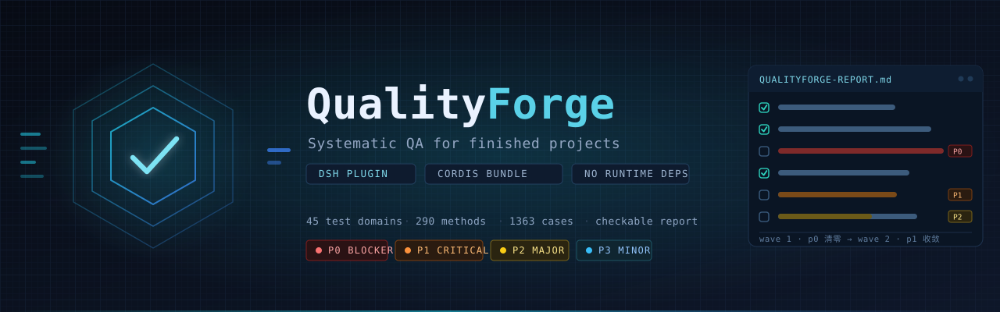

<div align="center">
  
</div>

<div align="center">

[简体中文](README.md) ｜ **English**

[](LICENSE)
[](https://github.com/topics/dsh-plugin)
[](package.json)
[](test/)
[](docs/CATALOG-AUTHORING.md)

</div>

---

**QualityForge is a DeepSeek Harness plugin that runs a systematic, enterprise-grade test pass over a
finished project and produces a per-item checkable report with P0–P3 severity** — a quality verdict, and
the artifact developers and the Harness use to agree on *what to fix and in which order*.

| Question | What QualityForge gives you |
| --- | --- |
| Can this ship? | A verdict: ⛔ Blocked / ⏳ Audit incomplete / ⚠️ Conditional / ✅ Ready |
| What exactly is wrong? | 45 test domains, 290 methods, 1363 independently verifiable checks — each with a conclusion, evidence and a fix suggestion |
| What first? | Fix waves (Wave 1 clears blockers → Wave 2 criticals → …) plus a handoff sheet you can paste back into the Harness |
| What after fixing? | Tick items in the report → `qf_update sync=true` reads them back → `qf_exec` re-tests → only then does an item become *verified* |

> The report, catalog and tool descriptions are written in Chinese today; an English report locale is on
> the roadmap. Identifiers (`QF-001`), statuses and the JSON artifacts are language-neutral.

---

## Contents

- [Features](#features)
- [Install](#install)
- [Quick start](#quick-start)
- [Usage](#usage)
- [Tools](#tools)
- [Coverage](#coverage)
- [Artifacts](#artifacts)
- [Security boundaries](#security-boundaries)
- [FAQ](#faq)
- [Development](#development)
- [Compatibility](#compatibility)
- [License](#license)

---

## Features

| Feature | Detail |
| --- | --- |
| **Enterprise test-method catalog** | 45 domains / 290 methods / 1363 cases: build & dependencies, static quality, unit and advanced testing, integration & contracts, API layer, UI & accessibility, E2E & acceptance, data, performance & capacity, security & compliance, reliability, observability & ops, engineering process, plus DSH-plugin-specific and open-source-readiness domains |
| **Four depths** | `smoke` 331 / `standard` 984 / `deep` 1295 / `exhaustive` 1363 items, expanded by `tier`, filterable by domain |
| **Project-type aware** | Detects library / cli / service / web / desktop / mobile / plugin / data / ml / monorepo and skips what cannot apply (a CLI has no multi-region failover) — **skips are reported with reasons**, never counted as passes |
| **Evidence first** | Reconnaissance conclusions come from disk evidence only; every defect needs evidence, reproduction steps, files and a recommendation |
| **Automated runs with exact write-back** | 11 preset commands (build, typecheck, lint, format, test, coverage, e2e, dependency audit, secret scan, install, outdated); results are written back to the exact test item by method + title. A missing tool is *skipped*, never a failure |
| **Checkable report + read-back** | One checkbox per item in Markdown; `qf_update sync=true` writes the ticks back into structured data (`WONTFIX` / `DEFER` / `NA` markers supported) |
| **Fix-scope negotiation** | `qf_fixplan` builds fix waves and a handoff sheet: fix everything, only P0-P1, specific ids, or everything except some ids |
| **Zero runtime dependencies** | Node built-ins only, no build step, no install scripts — it cannot break because a host package version or symlink layout changed |
| **Read-only recon, narrow execution surface** | Recon never writes; `qf_exec` only runs whitelisted preset commands; `qf_probe` only reaches loopback addresses |

---

## Install

**In-session** (needs `danger-full-access`):

```text
plugin_manager install_bundle target=dsh-qualityforge
plugin_manager install_bundle target=github:lpeixin/dsh-qualityforge
plugin_manager install_bundle target=/absolute/path/to/dsh-qualityforge
```

**CLI**:

```bash
dsh plugin --profile <profile> add dsh-qualityforge
dsh plugin --profile <profile> add github:lpeixin/dsh-qualityforge   # lib/ is committed, no build needed
dsh plugin --profile <profile> add /absolute/path/to/dsh-qualityforge
dsh --profile <profile> --dump-config | grep -A3 qualityforge       # verify the bundle layer
```

Restart DSH (or start a new session) after installing so the module is loaded.

**Disable without uninstalling** — in `~/.dsh/profiles/<profile>/cordis.patch.yml`:

```yaml
- id: qualityforge
  disabled: true
```

---

## Quick start

Ask, in a session, with the target project as the working directory:

> Run a full QA audit on this project at standard depth, then give me a report I can tick off item by item.

The Harness then works through:

```text
qf_scan   → recon: stack, project type, runnable commands, confirmed engineering gaps
qf_plan   → generate the checklist (depth=standard, applicability-filtered by default)
qf_exec   → build / typecheck / lint / test / coverage / dependency audit / secret scan
qf_probe  → loopback HTTP probes against a locally started service (optional)
qf_record → record the agent's deep-analysis conclusions (batched, with evidence)
qf_report → render Markdown + JSON, with verdict and fix waves
then: developer ticks → qf_update sync=true → qf_fixplan → fix → qf_exec to re-test
```

Artifacts live inside the audited project, never in the plugin:

```text
<project>/.qualityforge/
├── audit.json                  structured data (single source of truth)
├── QUALITYFORGE-REPORT.md      the checkable report
└── report.json                 machine-readable snapshot (for CI)
```

See what a report looks like: [sample report excerpt](docs/examples/QUALITYFORGE-REPORT.sample.md)
(a real self-audit of this very repository).

---

## Usage

### 1. Recon — `qf_scan`

```json
{ "projectPath": "/path/to/project", "force": true }
```

Produces a project profile: stack and package manager, project type, languages, runnable commands
(each with its source, e.g. `package.json#scripts.test`), test frameworks, CI/container/IaC/security
tooling, documentation completeness, and **confirmed engineering gaps** (a missing lockfile, suspected
hardcoded credentials, and so on). Secret findings record location and kind only — never the value.

### 2. Plan — `qf_plan`

```json
{ "depth": "standard", "categories": ["sec-input", "api-semantics"], "includeAll": false }
```

| depth | items | use |
| --- | ---: | --- |
| `smoke` | 331 | pre-release blocker list |
| `standard` | 984 | normal delivery audit (default) |
| `deep` | 1295 | deep audit of an important release |
| `exhaustive` | 1363 | first full audit, compliance evidence |

Every item gets a stable id (`QF-001`), a priority (P0–P3), a severity, a judgement mode
(auto / agent analysis / human confirmation) and an explicit pass criterion. Re-running is safe:
existing items keep their status and history; only `reset=true` rebuilds from scratch.

### 3. Run and probe — `qf_exec` / `qf_probe`

```json
{ "presets": ["build", "typecheck", "lint", "test", "coverage", "audit", "secrets"] }
```

```json
{ "urls": ["http://127.0.0.1:3000/health"], "expectStatus": 200, "itemId": "QF-512" }
```

`qf_exec` spawns only the preset commands discovered by recon (no shell, no arbitrary command strings);
`install` is opt-in because it mutates the working tree. `qf_probe` is restricted to loopback http(s),
GET/HEAD, with a truncated body.

### 4. Record conclusions — `qf_record`

```json
{
  "items": [
    {
      "id": "QF-142",
      "status": "fail",
      "actual": "`ORDER BY ${sort}` is interpolated into SQL at src/api/orders.ts:88",
      "recommendation": "Map sort fields through an allowlist; return 400 otherwise",
      "files": ["src/api/orders.ts:88"],
      "repro": ["GET /api/orders?sort=id;DROP TABLE users--"],
      "evidence": ["SQL log shows the interpolated statement"],
      "cwe": ["CWE-89"],
      "effort": "S"
    }
  ]
}
```

Judgement discipline: `fail` (with reproduction) / `pass` (with evidence) / `blocked` (environment or
dependency missing — **do not record as fail**) / `na` (does not apply, with a reason) / `wontfix`
(risk accepted).

### 5. Report — `qf_report`

```json
{ "reportPath": ".qualityforge/QUALITYFORGE-REPORT.md", "waveScope": "defects" }
```

Sections: how to use the report · verdict summary · priority & severity distribution · fix waves ·
**problem list with one checkbox per defect** · full checklist · skipped items · command evidence ·
project profile · re-test and sign-off table.

### 6. Negotiate fix scope — `qf_update` / `qf_fixplan`

Developers tick `- [x]` in the report (or `` `WONTFIX` `` / `` `DEFER` `` / `` `NA` ``); the Harness runs
`qf_update sync=true` to read the ticks back. Ticking a defect sets it to *fixed, pending re-test* — only
a re-test makes it *verified*.

Then pick a scope:

| scope | meaning |
| --- | --- |
| `all` | everything still open |
| `p0` / `p0-p1` | blockers only / the minimum shippable fix set |
| `defects` (default) | every failing or blocked item |
| `pending` | only items not judged yet |
| `ids` + `excludeIds` | explicit include/exclude |

Output is a fix handoff sheet — per item: expectation, observation, location, suggestion — plus the
constraints (touch only what is in scope, every fix must be verifiable, write ticks back when done).

---

## Tools

| Tool | Purpose | Key parameters |
| --- | --- | --- |
| `qf_scan` | Recon + confirmed gaps | `projectPath`, `force` |
| `qf_plan` | Generate the checklist | `depth`, `categories`, `includeAll`, `withRecon`, `reset` |
| `qf_exec` | Run preset checks, write results back | `presets`, `timeoutMs`, `maxOutputBytes`, `autoRecord`, `recordPass` |
| `qf_probe` | Loopback HTTP probes | `urls`, `method`, `expectStatus`, `expectBodyContains`, `itemId` |
| `qf_record` | Record conclusions (batched) | `items[]`, `createMissing` |
| `qf_list` | Query and filter items | `priorities`, `statuses`, `category`, `method`, `search`, `onlyOpen`, `limit` |
| `qf_update` | Change status / read ticks back | `ids`+`status`, or `sync=true` |
| `qf_report` | Render Markdown + JSON | `reportPath`, `waveScope`, `includePassedDetail`, `writeJson` |
| `qf_fixplan` | Fix waves + handoff sheet | `scope`, `ids`, `excludeIds`, `maxPerWave`, `format`, `writeFile` |
| `qf_reset` | Delete audit data | `confirm=true` |

The plugin also registers a methodology skill, `qualityforge-audit` (workflow, judgement discipline,
anti-patterns), whose body lives in `lib/SKILL.md` and can be edited after installation without touching code.

---

## Coverage

45 domains / 290 methods / 1363 cases — counts are verified by `npm run catalog:stats`.

| Group | Domains |
| --- | --- |
| Build & release | `build`, `deps`, `release` |
| Static quality | `static-analysis`, `lint-format`, `code-quality` |
| Testing | `unit-test`, `test-isolation`, `advanced-testing`, `integration`, `contract`, `test-double` |
| Interfaces | `api-semantics`, `api-errors`, `api-evolution`, `ui-interaction`, `ui-a11y`, `ui-compat`, `ui-i18n` |
| End-to-end | `e2e-journey`, `acceptance`, `regression` |
| Data | `data-schema`, `data-integrity`, `data-quality` |
| Performance | `performance`, `scalability`, `efficiency` |
| Security | `sec-authn`, `sec-authz`, `sec-input`, `sec-data`, `sec-supply` |
| Reliability & ops | `fault-tolerance`, `resilience-testing`, `recovery`, `observability`, `deployment`, `continuity` |
| Process & ecosystem | `docs`, `workflow`, `maintainability`, `dsh-plugin`, `oss-ready`, `distribution` |

Methods map to real standards where genuinely applicable: ISO/IEC 25010, ISTQB, ISO/IEC/IEEE 29119,
OWASP ASVS / Top 10, CWE Top 25, WCAG 2.2 AA, NIST SSDF, SLSA, Twelve-Factor, SRE golden signals, ITIL,
SemVer, Keep a Changelog, OpenSSF Scorecard, GDPR / PCI-DSS.

---

## Artifacts

| File | Purpose |
| --- | --- |
| `.qualityforge/audit.json` | Single source of truth: profile, items, runs, probes, skips, full history |
| `.qualityforge/QUALITYFORGE-REPORT.md` | Human-readable checkable report (deterministic render — safe to diff) |
| `.qualityforge/report.json` | Machine-readable snapshot (verdict, defects, waves, counters) for CI |

Minimal CI gate:

```bash
node -e "
const r = require('./.qualityforge/report.json');
if (r.summary.p0Open > 0) { console.error('blockers:', r.summary.p0Open); process.exit(1); }
if (r.summary.verdict === 'incomplete') { console.error('audit incomplete:', r.summary.pending); process.exit(1); }
console.log('quality gate passed:', r.summary.verdictLabel);
"
```

---

## Security boundaries

QualityForge runs inside the DSH host process, outside the workspace sandbox, so its surface is
deliberately narrow (see [SECURITY.md](SECURITY.md)):

| Capability | Boundary |
| --- | --- |
| Filesystem | Read-only recon of the audited project; writes only inside its `.qualityforge/` |
| Execution | Only recon-discovered preset commands, spawned without a shell; `install` is opt-in |
| Network | Loopback http(s) only, GET/HEAD, truncated responses |
| Credentials | Never read or stored; secret findings record location and kind only |
| Session | No custom session events are written |
| Dependencies | No external imports, no install scripts |

Recommended reproductions in the report are harmless probes (random-token echo, timing, errors) —
never destructive exploitation.

---

## FAQ

<details>
<summary><b>How is this different from asking an agent to review the code?</b></summary>

A code review depends on improvisation; coverage is neither reproducible nor comparable. QualityForge
draws items from an explicit catalog, so the same project at the same depth yields the same ids — you can
answer "are the 300 items that passed last time still passing?" and the report diffs cleanly.
</details>

<details>
<summary><b>1363 items sounds like a lot.</b></summary>

Pick your depth: 331 / 984 / 1363. You can also narrow by `categories`; inapplicable items are filtered
by project type; and most automation-judged items are settled in bulk by `qf_exec`.
</details>

<details>
<summary><b>Will it modify my project or install dependencies?</b></summary>

No. Recon is read-only, `qf_exec` runs only discovered presets (`install` off by default), `qf_probe`
only reaches loopback, and every write goes into `.qualityforge/`.
</details>

<details>
<summary><b>Is a missing tool reported as a project defect?</b></summary>

No — it is recorded as skipped and the item stays "not judged", with the reason attached.
</details>

<details>
<summary><b>Why were some items skipped, and does that hide problems?</b></summary>

Items are skipped only when the project type cannot have that surface (a CLI has no multi-region
failover). Every skip is listed with its reason in section 6. Use `qf_plan includeAll=true` to force them.
</details>

<details>
<summary><b>Does ticking a box mean "verified"?</b></summary>

No: ticking sets *fixed, pending re-test*; only a re-test sets *verified*. The two states are counted
separately.
</details>

---

## Development

```bash
git clone https://github.com/lpeixin/dsh-qualityforge.git
cd dsh-qualityforge

node --test                       # 21 tests (unit + end-to-end)
npm run validate                  # catalog contract + preset-mapping checks
npm run catalog:stats
```

Zero dependencies, no build step: the plugin uses Node built-ins only, so a clone is immediately runnable.

Three hard rules (see [CONTRIBUTING.md](CONTRIBUTING.md)):

1. **No external imports** — nothing to resolve at install time, nothing to break when host packages move;
2. **Named exports only, no `export default`** — the Loader's `unwrapExports` would otherwise drop `inject`;
3. **Never modify the audited project and never write custom session events.**

Adding test cases is the most valuable contribution: edit a pure-data module under `lib/catalog/`,
follow [docs/CATALOG-AUTHORING.md](docs/CATALOG-AUTHORING.md), then run `npm run validate`.

---

## Compatibility

| Item | Requirement |
| --- | --- |
| DSH | Any version supporting Cordis plugins and the `dsh.bundle.patch` contract |
| Node.js | ≥ 20.11 (CI runs 20.x and 22.x) |
| Platform | macOS / Linux / Windows (built-ins and `spawn` only, no native modules) |
| Install size | ~300 KB (excluding audit artifacts of audited projects) |

If a composition lacks the `skills` service, skill registration is skipped and the tools still work.

---

## License

[MIT](LICENSE) © 2026 Peixin
